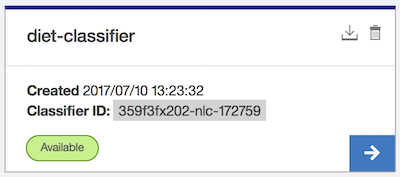

# Q&A Chatbot

## はじめに  
* このアプリは、Bluemix Cloud Foundry 上で稼動する「一問一答形式のチャットボット」です。
* 任意のブラウザーから使用できますが、音声認識と音声合成 (テキストの読み上げ) は PC 版の Firefox または Chrome のみ対応しております。

## 使い方  
* 任意のブラウザーで以下のURLにアクセスしてください。
  - https://qa-chatbot.eu-gb.mybluemix.net/
* ダイエットに関する Q&A を学習させております。質問の例を以下に示します。 
  - 食事に制限がない方法でダイエットしたい。
  - ダイエットする方法を何か教えてください。
  - 小顔になるにはどうすればいいですか?
* あいさつの場合は時刻により回答が変わります。
  - 5〜11時: おはよう
  - 11〜17時: こんにちは
  - 17時〜24時: こんばんは
  - 0〜5時: お疲れ様です

## セットアップ
このアプリをご自身の Bluemix 環境にセットアップする手順を以下に示します。

1. qa-chatbot アプリを PC にダウンロード (Download ZIP) して解凍してください。ディレクトリ名は qa-chatbot-master から qa-chatbot に変更してください。

1. Bluemix コンソールにログインしてください。ここでは以下の条件で説明します。ご自身のアカウント情報に読替えて手順を進めてください。
    - 地域: 英国
    - 組織: jiec_rd
    - スペース: dev

1. Bluemix コンソールで Cloud Foundry アプリ「SDK for Node.js™」を作成してください。以下の ippei0605 はご自身のユーザ名などに変更してください。
アプリケーション名: qa-chatbot-ippei0605 (任意、前述の URL と同じ名前にならないようにしています。)
    > 以降、qa-chatbot-ippei0605 で説明します。

1. PC に Bluemix コマンド・ライン・インターフェースをインストールしていない場合は、インストールしてください。Bluemix コンソール、アプリケーション内の開始 (Getting Started) メニューからダウンロードすることができます。

1. Bluemix コンソールで、Cloudant NoSQL DB をサービスを作成し、qa-chatbot-ippei0605 にバインドしてください。
    - サービス名: 任意  
    - プラン: 任意 (私は「Lite」を選択しました。)  

1. Bluemix コンソールで、Natural Language Classifier サービスを作成し、qa-chatbot-ippei0605 にバインドしてください。
    - サービス名: 任意  
    - プラン: 任意 (私は「標準」を選択しました。)  

1. Bluemix コンソールで、Speech To Text サービスを作成し、qa-chatbot-ippei0605 にバインドしてください。
    - サービス名: 任意  
    - プラン: 任意 (私は「標準」を選択しました。)  

1. Bluemix コンソールで、Text to Speech サービスを作成し、qa-chatbot-ippei0605 にバインドしてください。  
    - サービス名: 任意 
    - プラン: 任意 (私は「標準」を選択しました。)  

1. PC のターミナルソフトを起動してください。 (私は IntelliJ IDEA や Eclipse のターミナルを使っていますが、Windows の cmd 、Mac の　ターミナルなどで操作できます。)

1. ターミナルで、解凍したディレクトリ (qa-chatbot アプリのホーム) に移動してください。(コマンドは以下、$ はコマンドプロンプトです。)
    ```
    $ cd qa-chatbot
    ```

1. ターミナルで、Bluemix にログインしてください。前述の条件の通り、エンドポイントが英国になっていることに注意してください。
    ```
    $ bx login -a https://api.eu-gb.bluemix.net
    ```

1. ターミナルで、アプリをデプロイしてください。
    ```
    $ bx app push qa-chatbot-ippei0605
    ```

1. 15分程で Q&A の学習が完了します。
  1. Bluemix コンソールで、Natural Language Classifier の管理画面から「Natural Language Classifier Toolkit (beta)」をクリックしてください。
  1. Sign in with Bluemix をクリックしてください。
  1. 以下のように Avairable となっていれば学習完了です。  
    

1. ブラウザーから以下の URL にアクセスしてください。
  - https://qa-chatbot-ippei0605.eu-gb.mybluemix.net/


## Bluemix 構成
### ランタイム
|ビルドパック|インスタンス|メモリー|
|-----------|---------:|------:|
|SDK for Node.js™|1|256MB|

### 環境変数
|名前             |設定                                                      |デフォルト(未設定)|
|----------------|----------------------------------------------------------|---------------------------|
|CLASSIFIER_ID   |Natural Language Classifier の Classifier ID に 設定値を使用|最新の Classifier の IDを使用|
|CUSTOMIZATION_ID|Speech To Text の Customization ID に設定値を使用           |標準モデルを使用|

### サービス
|名前     |プラン|用途  |
|---------|-----|-----|
|[Cloudant NoSQL DB](https://console.bluemix.net/catalog/services/cloudant-nosql-db?env_id=ibm:yp:eu-gb&taxonomyNavigation=services)|Lite|データベース|
|[Natural Language Classifier](https://console.bluemix.net/catalog/services/natural-language-classifier?env_id=ibm:yp:eu-gb&taxonomyNavigation=apps)|標準|テキストのクラス分類|
|[Speech To Text](https://console.bluemix.net/catalog/services/speech-to-text?env_id=ibm:yp:eu-gb&taxonomyNavigation=services)|標準|音声認識
|[Text to Speech](https://console.bluemix.net/catalog/services/text-to-speech?env_id=ibm:yp:eu-gb&taxonomyNavigation=services)|標準|音声合成 (テキスト読上げ)

## ファイル構成  
```
qa-chatbot
├── .cfignore
├── .gitignore
├── README.md                       本書
├── app.js                          アプリ
├── gulpfile.js                     開発用タスク
├── docs
│   └── classifier-status.png       README.md の
├── install
│   ├── answer.json                 データ
│   ├── classifier.csv              NLC トレーニングのデータ
│   ├── list.function               Cloudant のマップファンクション
│   └── postinstall.js              インストール後処理
├── models
│   └── qa.js                       モデル
├── package.json
├── public
│   ├── bundle.min.css              gulp で結合・最小化した CSS
│   ├── bundle.min.js               gulp で結合・最小化した JavaScript
│   ├── dev
│   │   ├── chatbot.css             開発用 CSS
│   │   ├── index.js                開発用 クライアント JavaScript
│   │   ├── mybootstrap.css         開発用 CSS
│   │   └── watson-speech.min.js    speech-javascript-sdk (*1)
│   ├── favicon.ico
│   └── watson_black_animate.gif
├── routes
│   └── index.js                    ルーティング
├── utils
│   └── context.js                  コンテキスト
└── views
    └── index.ejs                   画面
```

> (*1) https://github.com/watson-developer-cloud/speech-javascript-sdk/releases から v0.33.1 を配置しました。

## データベース  
* データベース名: answer
* デザイン文書
  - _design/answers/list : 一覧表示 (ビュー) に使用します。
* 文書構成
  - アプリ設定文書
  
    |項目    |必須|値         |
    |-------|---|------------|
    |_id    |◯ |app_settings|
    |name   |◯ |アプリ名     |
    
  - コンテンツ文書構成  

    |項目      |必須|説明      |
    |---------|---|-----------|
    |_id      |◯ |Document ID: NLC のクラス名|
    |message  |◯ |メッセージ|
    |questions|   |NLC のテキスト (配列)|

    > データは install/answer.json です。

## ルート (URLマッピング)  
|Action             |Method|処理|
|-------------------|------|------------------------|
|/                  |GET   |Chatbot 画面を表示します。|
|/ask               |GET   |Natural Language Classifier で質問をクラス分類して、回答を返します。|
|/ask-classname     |GET   |クラス名指定により回答を返します。(定型文に使用)|
|/use-watson-speech |GET   |Watson Speech to Text と Text to Speech のトークンを取得して、JSON を返します。|

## 開発支援
このアプリを改造するためのヒントを以下に示します。

### 前提条件
* PC に Node.js が必要です。
* ネットワークに Proxy を使用している場合は npm が Proxy 経由で実行できるように設定してください。(環境変数または npm config)
* node_modules をダウンロードします。以下のコマンドを実行してください。

    ```
    $ npm install
    ```

    > この時、ネットワークに Proxy を使用している場合は install/postinstall.js でエラーが発生します。しかし、上記のセットアップ手順でデータ登録と学習は完了していますので無視してください。

### ローカル環境での実行
* ネットワークに Proxy を使用している場合は実行できません。
* PC に 環境変数 VCAP_SERVICES を設定してください。 (値は Bluemix 環境と同値、改行は除く)
* 以下のコマンドで JSDoc を作成できます。詳細は package.json を確認してください。

    ```
    $ npm start
    ```

### クライアント JavaScript と CSS
* 開発用の JavaScript と CSSは public/dev に保存しております。
* view/index.ejs からは 上記を結合・最小化した bundle.min.css および bundle.min.js を参照しております、
* 変更する場合は、開発用ディレクトリのソースを変更した後に、以下のコマンドで結合・最小化をしてください。詳細は package.json および gulpfile.js を確認してください。 (JavaScript の最小化は gulp プラグインが ES6 未対応のため babili を使用)

    ```
    $ npm run build
    ```

### JSDoc
* 以下のコマンドで JSDoc を作成できます。詳細は package.json を確認してください。

    ```
    $ npm run doc
    ```
    