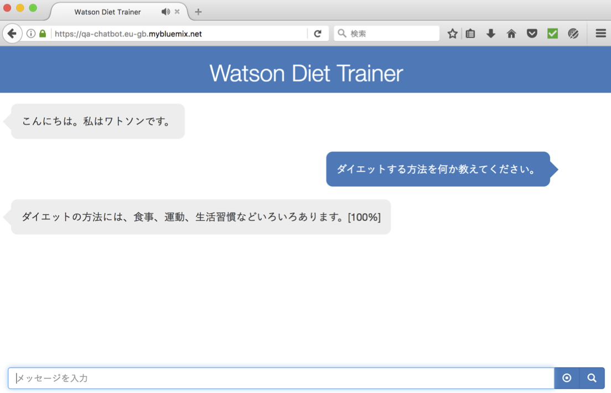

# Q&A Chatbot

## はじめに
このアプリはダイエットに関する質問に AI が回答する「一問一答形式のチャットボット」です。

## 使い方
* ブラウザーで以下のURLにアクセスしてください。
    - https://qa-chatbot.eu-gb.mybluemix.net/

    

    > 音声認識、音声合成 (テキストの読上げ) は PC の Firefox および Chrome のみ対応しております。

* 質問をしてみてください。質問の例を以下に示します。 
    - 食事に制限がない方法でダイエットしたい。
    - ダイエットする方法を何か教えてください。
    - 小顔になるにはどうすればいいですか？

    

* 音声認識ができます。

    

* サービス時間は 9:00〜21:00 です。サービス時間外はアプリを停止しております。
    - あいさつの場合は時刻により回答が変わります。  
        - 5〜11時: おはよう
        - 11〜17時: こんにちは
        - 17時〜24時: こんばんは
        - 0〜5時: お疲れ様です (サービス時間外ですが、PCの時刻を変更することで確認できます。) 

## 開発者向け情報
このアプリはBluemix Cloud Foundry の SDK for Node.js™ で稼動しております。ここからは Bluemix の知識がある開発者向けの情報を示します。

### セットアップ
このアプリをご自身の Bluemix 環境にセットアップする手順を以下に示します。 Bluemix コンソール (ブラウザー) とターミナルソフトでの Bluemix コマンドの操作が必要になります。

1. qa-chatbot アプリを PC にダウンロード (Download ZIP) して解凍してください。ディレクトリ名は qa-chatbot-master から qa-chatbot に変更してください。

1. Bluemix コンソールにログインしてください。ここでは以下の条件で説明します。ご自身のアカウント情報に読替えて手順を進めてください。
    - アカウント: JIEC Co., Ltd.
    - 地域: 英国
    - 組織: jiec_rd
    - スペース: dev

1. Bluemix コンソールで Cloud Foundry アプリ「SDK for Node.js™」を作成してください。
    - アプリケーション名: B20-O970605-qa-chatbot (任意、同じ地域で名前が重複しないように接頭語や接尾語を付けてください。)
        
        > 以降、B20-O970605-qa-chatbot で説明します。  
        > なお、作成されるアプリの URL は https://b20-o970605-qa-chatbot.eu-gb.mybluemix.net/ になります。  
        > (サブドメイン 英国: eu-gb, シドニー: au-syd, ドイツ: eu-de, 米国南部: なし)

1. PC に Bluemix コマンド・ライン・インターフェースをインストールしていない場合は、インストールしてください。Bluemix コンソール、アプリケーション内の開始 (Getting Started) メニューからダウンロードすることができます。

1. Bluemix コンソールで、Cloudant NoSQL DB をサービスを作成し、B20-O970605-qa-chatbot にバインドしてください。
    - サービス名: 任意  
    - プラン: 任意 (私は「Lite」を選択しました。)  

1. Bluemix コンソールで、Natural Language Classifier サービスを作成し、B20-O970605-qa-chatbot にバインドしてください。
    - サービス名: 任意  
    - プラン: 任意 (私は「標準」を選択しました。)  

1. Bluemix コンソールで、Speech To Text サービスを作成し、B20-O970605-qa-chatbot にバインドしてください。
    - サービス名: 任意  
    - プラン: 任意 (私は「標準」を選択しました。)  

1. Bluemix コンソールで、Text to Speech サービスを作成し、B20-O970605-qa-chatbot にバインドしてください。  
    - サービス名: 任意 
    - プラン: 任意 (私は「標準」を選択しました。)  

1. PC のターミナルソフトを起動してください。 (私は IntelliJ IDEA や Eclipse のターミナルを使っていますが、Windows の cmd 、Mac の　ターミナルなどで操作できます。)

1. ターミナルで、解凍したディレクトリ (qa-chatbot アプリのホーム) に移動してください。(コマンドは以下、$ はコマンドプロンプトです。)
    ```
    $ cd qa-chatbot
    ```

1. ターミナルで、Bluemix にログインしてください。前述の条件の通り、エンドポイントが英国 (eu-gb) になっていることに注意してください。
    ```
    $ bx login -a https://api.eu-gb.bluemix.net
    ```

    > Email、Password の入力が要求されます。  
    > 次いで、アカウント、組織、スペースは数値で選択します。(1つしかない場合は要求されません。)

1. ターミナルで、アプリをプッシュしてください。
    ```
    $ bx app push B20-O970605-qa-chatbot
    ```
    - インストール後に自動的に以下を実行します。
        1. データベースにデータ (設計文書、アプリ設定、コンテンツ) を登録します。
        1. Q&A の機械学習を実施します。
            - 15分程で機械学習が完了します。確認方法を以下に示します。
                1. Bluemix コンソールで、Natural Language Classifier の管理画面から「Natural Language Classifier Toolkit (beta)」をクリックしてください。  
                
                1. Sign in with Bluemix をクリックしてください。  
                
                1. 以下のように Avairable となっていれば学習完了です。  
                

1. ブラウザーから以下の URL にアクセスしてください。
    - https://B20-O970605-qa-chatbot.eu-gb.mybluemix.net/
    

### Bluemix 構成
#### ランタイム
|ビルドパック|インスタンス|メモリー|
|-----------|---------:|------:|
|SDK for Node.js™|1|256MB|

#### 環境変数
環境変数を設定することでアプリの動作を変更することができます。未設定の場合はデフォルトの動作をします。

|名前             |必須|デフォルトの動作 (未設定)                                               |設定時の動作                         |       
|----------------|----|---------------------------------------------------------------------|------------------------------------|
|CLASSIFIER_ID   |No  |Natural Language Classifier サービス内の最新の Classifier に問合せます。 |設定した Classifier に問合せます。     |
|CUSTOMIZATION_ID|No  |Speech To Text の標準モデル (ja-JP_BroadbandModel) で音声認識します。    |設定した カスタムモデルで音声認識します。|

#### サービス
|名前     |プラン|用途  |
|---------|-----|-----|
|[Cloudant NoSQL DB](https://console.bluemix.net/catalog/services/cloudant-nosql-db?env_id=ibm:yp:eu-gb&taxonomyNavigation=services)|Lite|データベース|
|[Natural Language Classifier](https://console.bluemix.net/catalog/services/natural-language-classifier?env_id=ibm:yp:eu-gb&taxonomyNavigation=apps)|標準|テキストのクラス分類|
|[Speech To Text](https://console.bluemix.net/catalog/services/speech-to-text?env_id=ibm:yp:eu-gb&taxonomyNavigation=services)|標準|音声認識
|[Text to Speech](https://console.bluemix.net/catalog/services/text-to-speech?env_id=ibm:yp:eu-gb&taxonomyNavigation=services)|標準|音声合成 (テキスト読上げ)

### アプリ構成
#### ファイル構成  
```
qa-chatbot
├── .cfignore
├── .gitignore
├── README.md                       本書
├── app.js                          アプリ
├── gulpfile.js                     gulpfile
├── docs                            README.md が参照する図表などの文書を保存
├── install
│   ├── answer.json                 Cloudant に登録するアプリ設定およびコンテンツのデータ
│   ├── classifier.csv              NLC のトレーニングデータ
│   ├── list.function               Cloudant に登録する設計文書 (マップファンクション)
│   └── postinstall.js              インストール後処理
├── models
│   └── qa.js                       モデル
├── package.json
├── public
│   ├── bundle.min.css              gulp で結合・最小化した CSS
│   ├── bundle.min.js               gulp で結合・最小化した JavaScript
│   ├── dev
│   │   ├── chatbot.css             開発用 CSS
│   │   ├── index.js                開発用 クライアント JavaScript
│   │   ├── mybootstrap.css         開発用 CSS
│   │   └── watson-speech.min.js    speech-javascript-sdk (*1)
│   ├── favicon.ico
│   └── watson_black_animate.gif
├── routes
│   └── index.js                    ルーティング
├── utils
│   └── context.js                  コンテキスト
└── views
    └── index.ejs                   画面
```

> (*1) https://github.com/watson-developer-cloud/speech-javascript-sdk/releases から v0.33.1 を配置しました。

#### データベース  
* データベース名: answer
* デザイン文書
  - _design/answers/list : 一覧表示 (ビュー) に使用します。
* 文書構成
  - アプリ設定文書
  
    |項目    |必須|値         |
    |-------|---|------------|
    |_id    |Yes|app_settings|
    |name   |Yes|アプリ名     |
    
  - コンテンツ文書構成  

    |項目      |必須|説明      |
    |---------|---|-----------|
    |_id      |Yes|Document ID: NLC のクラス名|
    |message  |Yes|メッセージ|
    |questions|No |NLC のテキスト (配列)|

    > データは install/answer.json です。

#### ルート (URLマッピング)  
|Action             |Method|処理|
|-------------------|------|------------------------|
|/                  |GET   |Chatbot 画面を表示します。|
|/ask               |GET   |Natural Language Classifier で質問をクラス分類して、回答を返します。|
|/class-name        |GET   |クラス名指定により回答を返します。(定型文に使用)|
|/watson-speech     |GET   |Watson Speech to Text と Text to Speech のトークンを取得して、JSON を返します。|

### 開発支援
このアプリを改造するためのヒントを示します。 アプリは Node.js で記述しておりますので、まずは package.json でスクリプトや依存モジュールを確認してください。

#### データの変更
* コンテンツ (質問と回答) を変更する手順を以下に示します。
  - Bluemix コンソールから、Cloudant NoSQL DB サービスをクリック、Cloudant Dashboard を起動してください。
  - データ登録には以下の2通りの方法がございます。
    1. Cloudant Dashboard で直接データを編集します。
    1. Cloudant Dashboard でデータベースを削除、install/answer.json ファイルを編集して、アプリを再度プッシュします。
* 詳しくは、[install/postinstall.js # createDatabase()](https://github.com/ippei0605/qa-chatbot/blob/master/install/postinstall.js#L74-L75) を確認してください。

#### 機械学習
* 質問と回答の結び付きを AI に学習させることで応答させることができます。機械学習の手順を以下に示します。
  - Bluemix コンソールから、Natural Language Classifier サービスをクリック、Natural Language Classifier Toolkit (beta) を起動してください。
  - 不要な Classifier があれば削除してください。
  - 機械学習には以下の2通りの方法がございます。
    1. Natural Language Classifier Toolkit (beta) の Training data 画面で学習データをアップロードして、Create Classifier してください。学習データは、"質問","クラス"の2項目からなるCSVファイルです。install/classifier.csv を参考にしてください。
    1. install/classifier.csv を編集して、アプリを再度プッシュします。
* 詳しくは、[install/postinstall.js # createClassifier()](https://github.com/ippei0605/qa-chatbot/blob/master/install/postinstall.js#L94-L95)を確認してください。

#### プログラムの変更
##### 前提条件
* ローカル環境での作業を前提としております。
* PC に Node.js が必要です。
* 任意のテキストエディタ (Atom など) や IDE を使用してください。
* ネットワークに Proxy を使用している場合は npm が Proxy 経由で実行できるように設定してください。(環境変数または npm config)
* node_modules をダウンロードします。以下のコマンドを実行してください。

    ```
    $ npm install
    ```

    > この時、ネットワークに Proxy を使用している場合は install/postinstall.js でエラーが発生します。しかし、上記のセットアップ手順でデータ登録と学習は完了していますので無視してください。

##### ローカル環境での実行
* ネットワークに Proxy を使用している場合は実行できません。
* PC に 環境変数 VCAP_SERVICES を設定してください。 (値は Bluemix 環境と同値、改行は除く)

    ```
    $ npm start
    ```

##### クライアント JavaScript と CSS
* 開発用の JavaScript と CSSは public/dev に保存しております。
* view/index.ejs からは 上記を結合・最小化した bundle.min.css および bundle.min.js を参照しております、
* 変更する場合は、開発用ディレクトリのソースを変更した後に、以下のコマンドで結合・最小化をしてください。詳細は gulpfile.js を確認してください。 (JavaScript の最小化は gulp プラグインが ES6 未対応のため babili を使用)

    ```
    $ npm run build
    ```

##### JSDoc
* 以下のコマンドで out ディレクトリ配下に JSDoc を作成できます。 (git および アプリのプッシュ対象外に設定)

    ```
    $ npm run doc
    ```
    
    
